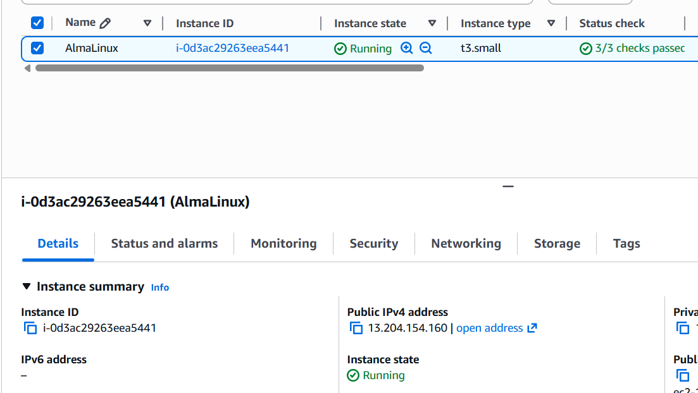
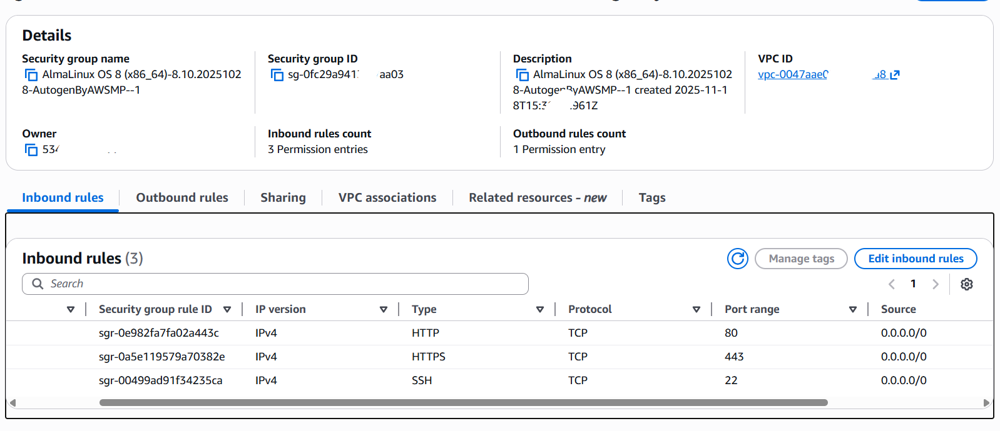
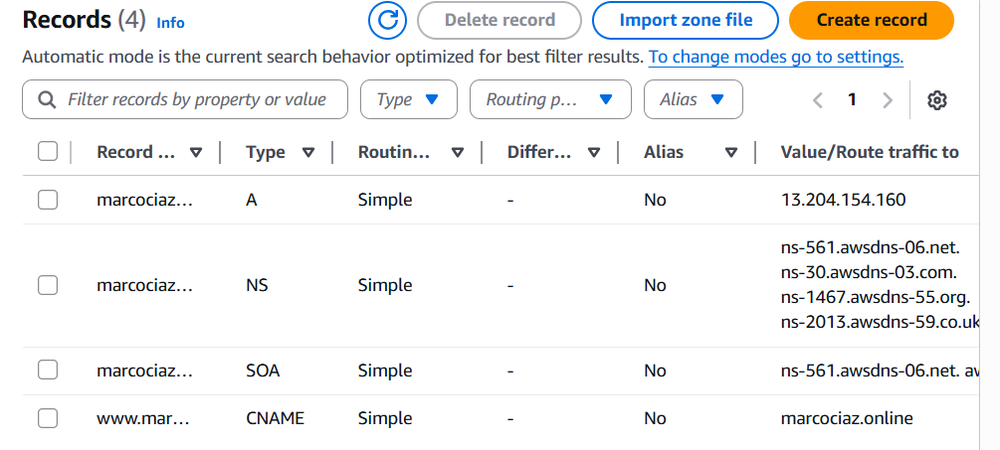
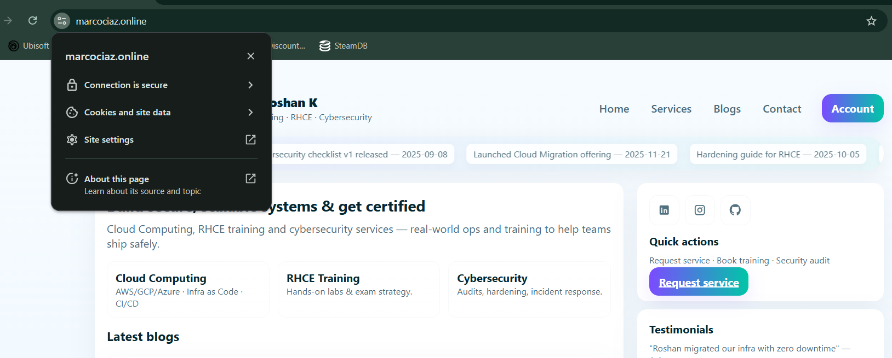

# AWS Secure Web Hosting Project

## 🔹 Overview

This project demonstrates the end-to-end deployment of a secure, production-ready website on Amazon Web Services (AWS) using an EC2 instance running AlmaLinux with a fully configured LAMP stack, custom domain integration, HTTPS security, and controlled network access.

## 🔹 Architecture

User → Route 53 (DNS) → AWS EC2 (AlmaLinux) → Apache (LAMP Stack)

## 🔹 Technologies Used

* Amazon Web Services (AWS)
* Amazon EC2 (AlmaLinux)
* Apache Web Server
* MySQL
* PHP
* AWS Route 53 (DNS)
* SSL/TLS (HTTPS)
* AWS Security Groups

## 🔹 Implementation Steps

1. Launched an Amazon EC2 instance using AlmaLinux.
2. Installed and configured the LAMP (Linux, Apache, MySQL, PHP) stack.
3. Set up Apache Virtual Hosts to host the website properly.
4. Integrated a GoDaddy domain with AWS using Route 53 DNS.
5. Configured A and CNAME records for proper domain mapping.
6. Enabled HTTPS using an SSL/TLS certificate for secure communication.
7. Secured the server using AWS Security Groups by allowing only required inbound traffic.
8. Tested and validated public access via a web browser with HTTPS enabled.

## 🔹 Features

* Secure web hosting on AWS
* Custom domain integration
* Encrypted communication using HTTPS
* Controlled access using Security Groups
* Scalable and cost-effective cloud deployment

## 🔹 Screenshots

## 📸 Screenshots

### AWS Architecture

### EC2 Instance

### Security Group

### Route 53 DNS Records

### Website Running on HTTPS

## 🔹 Future Enhancements

* Automate deployment using Infrastructure as Code (Terraform or CloudFormation)
* Add load balancing using AWS Application Load Balancer
* Implement monitoring using CloudWatch
* Configure automatic backups
***********************************************************************************************
